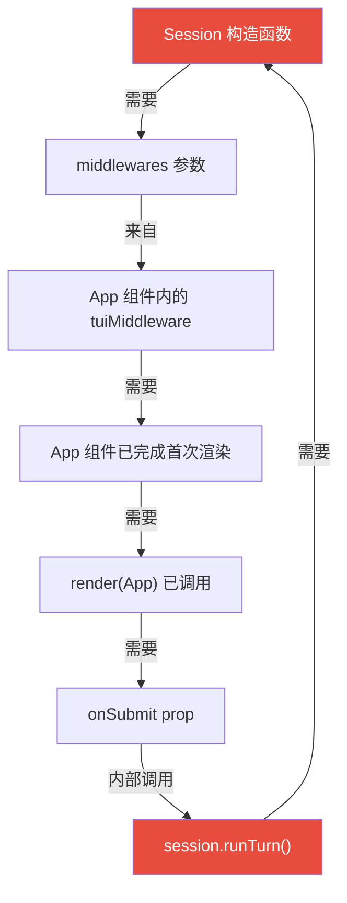

# Phase 8 桥接模式深度解析

> 聚焦于 1.3「鸡生蛋问题」和 1.4「文件分工」，结合**真实代码**逐行对照讲解。
> 读完后你应该能回答：为什么 Session 不在 `render()` 之前创建？`useEffect` 为什么保证了安全？

---

## 一、问题是什么？——循环依赖的本质

我们有两个对象需要互相引用：

```
Session <──需要──> App 组件
```

具体来说，三条依赖链形成了一个**环**：



用代码语言重新表述：

| 依赖方 | 被依赖方 | 原因 |
|--------|----------|------|
| `Session` 构造函数 | `tuiMiddleware` | `buildHookRunners()` 在构造时就把 middleware 的 handler 注册到 `HookRunnerMap` |
| `tuiMiddleware` | App 组件渲染 | 它是 `useMemo` 在组件函数体内创建的 |
| App 渲染 | `onSubmit` prop | `render(App, { onSubmit })` 必须传入 |
| `onSubmit` | `session` 变量 | `handleSubmit` 内部调用 `session.runTurn()` |

**环的入口和出口都是 `session`——它既是依赖的起点，也是依赖的终点。**

---

## 二、解法：延迟初始化 + 闭包桥接

### 2.1 核心洞察

> **Session 不需要在 `render()` 之前创建——只需要在用户第一次按下回车之前创建。**

这个洞察把"环"切开了：

```
时间轴：
──────────────────────────────────────────────────────────────
0ms        render(App)       useEffect触发       用户首次输入
 │              │                 │                    │
 │              │                 │                    │
 ▼              ▼                 ▼                    ▼
创建资源     App首次渲染     onMiddlewareReady    handleSubmit
callLLM      tuiMiddleware    → new Session()     → session.runTurn()
router       被 useMemo      session 赋值完毕     ✅ session 已就绪
orchestrator 创建完成
```

关键：**JavaScript 是单线程的**。`useEffect` 回调在首次渲染后、事件循环空闲前同步执行。用户按键是一个新的事件——它必须等到当前调用栈清空后才会被处理。所以 `session` **必然**在 `handleSubmit` 被调用之前完成赋值。

### 2.2 打破循环：三个变量 + 三个回调

在 [index.ts](file:///d:/For%20coding/project/Agents/example/cclin/src/index.ts#L91-L98) 中，"桥"由三个 `let` 变量构成：

```typescript
// index.ts L95-97
let session: Session | null = null
let requestApprovalFn: ((req: ApprovalRequest) => Promise<ApprovalDecision>) | null = null
let onAssistantChunkFn: ((step: number, chunk: string) => void) | null = null
```

它们的共同特点：**声明时为 `null`，稍后由 App 组件回传赋值**。

对应三个回调函数（也在 index.ts 中定义）：

| 回调 | 触发时机 | 做了什么 |
|------|----------|----------|
| `handleMiddlewareReady(mw)` | App 的 `useEffect` | 用 `mw` 创建 `Session` 并赋值 |
| `handleApprovalReady(fn)` | App 的 `useEffect` | 保存审批函数到 `requestApprovalFn` |
| `handleAssistantChunkReady(fn)` | App 的 `useEffect` | 保存流式回调到 `onAssistantChunkFn` |

### 2.3 "桥"的两端：代码对照

**App 端（发送端）** — [app.tsx L138-149](file:///d:/For%20coding/project/Agents/example/cclin/src/tui/app.tsx#L138-L149)：

```typescript
// App 组件内部的 useEffect
React.useEffect(() => {
    onMiddlewareReady(tuiMiddleware)       // ① 把 middleware 传出去
    onApprovalReady(requestApproval)       // ② 把审批函数传出去
    onAssistantChunkReady((step, chunk) => {  // ③ 把流式回调传出去
        dispatch({
            type: 'assistant_chunk',
            turn: currentTurnRef.current,
            step,
            chunk,
        })
    })
}, [tuiMiddleware, requestApproval, ...])
```

**index.ts 端（接收端）** — [index.ts L125-153](file:///d:/For%20coding/project/Agents/example/cclin/src/index.ts#L125-L153)：

```typescript
const handleMiddlewareReady = (mw: AgentMiddleware) => {
    session = new Session({          // ← 此时才创建 Session！
        callLLM,
        systemPrompt,
        executeTool: orchestrator.createExecuteTool({
            requestApproval: (req) => {
                if (!requestApprovalFn) return Promise.resolve('deny')
                return requestApprovalFn(req)  // ← 闭包引用延迟赋值的变量
            },
        }),
        middlewares: [mw],           // ← mw 来自 App 组件
        onAssistantChunk: (step, chunk) => {
            if (onAssistantChunkFn) onAssistantChunkFn(step, chunk)
        },
        // ...
    })
}
```

> [!IMPORTANT]
> 注意 `requestApproval` 回调内部用了 `if (!requestApprovalFn)` 守卫。这是因为 `handleMiddlewareReady` 和 `handleApprovalReady` 是在同一个 `useEffect` 中**顺序调用**的，但 Session 构造函数闭包捕获的是 `requestApprovalFn` **变量的引用**（不是值）。所以即使 Session 创建时 `requestApprovalFn` 还是 `null`，等到 `useEffect` 执行完毕，它就已经被 `handleApprovalReady` 赋值了。

